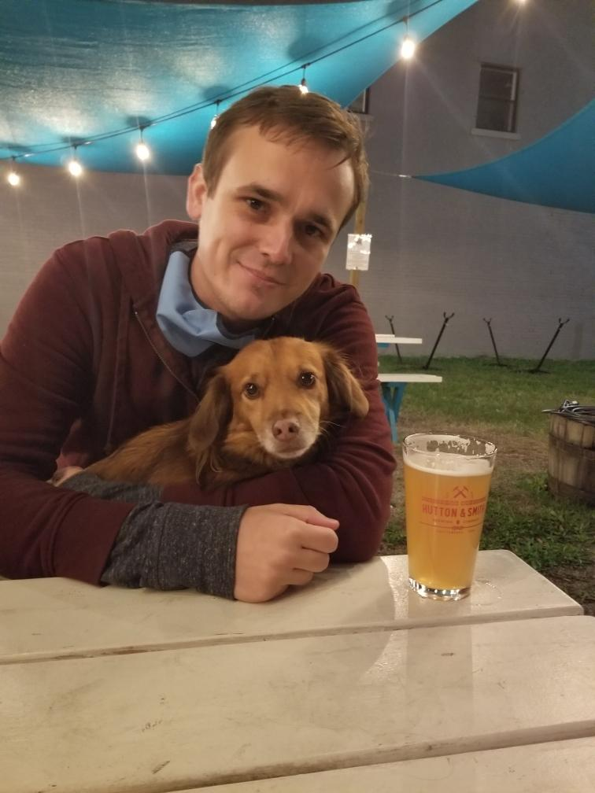

 

### Fire Risk Model

:::: {style="display: flex; width: 50%;"}

::::

:::: {style="display: flex;"}
I worked on this project as a part of our Chattalytics program in the Performance Management and Open Data Office in the city. The goal was to develop a decision support tool to help prioritize fire inspections done by the Chattanooga Fire Department. To do this, I developed a machine learning model based on previous fire calls and parcel attributes. I also combined this with non predictive variables to add more context to the tool and better assist the decision making of the fire department. For more information check out the <a href="https://www.chattadata.org/stories/s/jxzy-f5id" target="_blank">write up done by our office</a> or <a href="https://www.chattanoogan.com/2020/12/28/420612/New-Predictive-Data-Model-Streamlines.aspx" target="_blank"> the story done by local media</a>.
::::

 

### Analyzing air quality with Hadoop and Spark

:::: {style="display: flex; width: 50%;"}
{width="49%"}
::::

:::: {style="display: flex;"}
This is a project I worked on for a class focussed on analyzing big data using Hadoop. Chattanooga historically had poor air quality, and I wanted to see how air quality had changed over time in the region. To do this, I used the <a href="https://aqs.epa.gov/aqsweb/documents/data_api.html" target="_blank">EPA’s Air Quality System API</a> to download the data. I then used Hive, Spark, and Hadoop to analyze data. To help answer and explain the project questions I used Plotly for data visualization. <a href="https://drive.google.com/file/d/1kwhTVHLFMMaLD9SxioBASqBkBA54-OaM/view" target="_blank">Here’s a link</a> to the project paper I wrote for more information on the project.
::::

 

### Data Health Dashboard

:::: {style="display: flex; width: 50%;"}

::::

:::: {style="display: flex;"}
I used the <a href ="https://www.chattadata.org/stories/s/7j3y-7jke" target="blank">dashboard here</a> to track my daily work and make sure that data is successfully flowing into the city’s data warehouse. The section I check everyday is the job log timeline. Workflows are used to update datasets nightly, and these visuals display how many workflows were successful <a href ="https://www.chattadata.org/dataset/Automated-Job-Log-Timeline/g2q3-pr3e" target="blank">each day</a> or <a href ="https://www.chattadata.org/dataset/Automated-Job-Log-Timeline-Monthly-View/3727-expe" target="blank">each month</a> . I started with the city in November 2018 if you want to see how I did in my time there.
::::